# Sprints_TERRAFORM_03_Load-Balancers

## Task 3 - S_TERRAFORM_03: Use Remote State, State Lock And Terraform Modules (Load balancers, pervisioned instances, VPC, S3-Bucket, Backend)

### Screenshot from creating and working on workspace dev

- 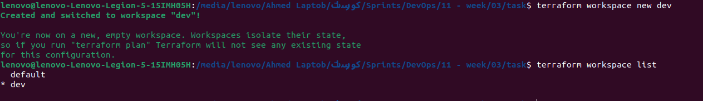

### Screenshot from the configuration of the proxy

- 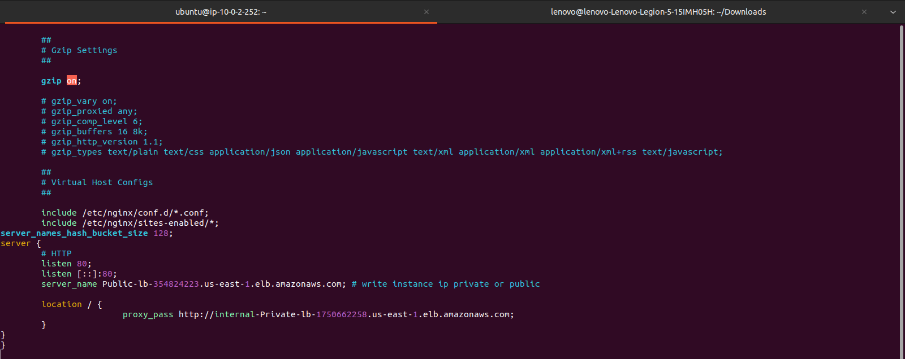

### Screenshot from the public dns of the load balancer when you send a traffic to it from a browser and it returns the content of the private ec2s

- 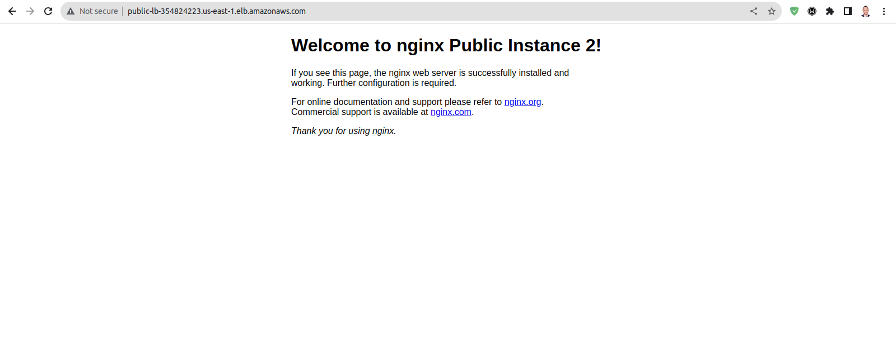
- 
- 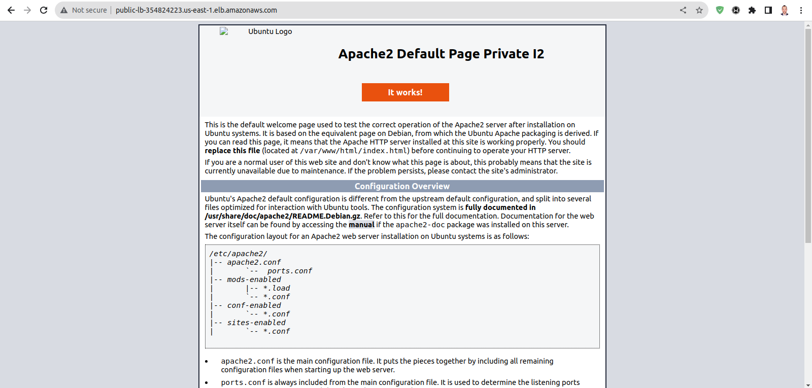

### Screenshot from the s3 that contain the state file

- 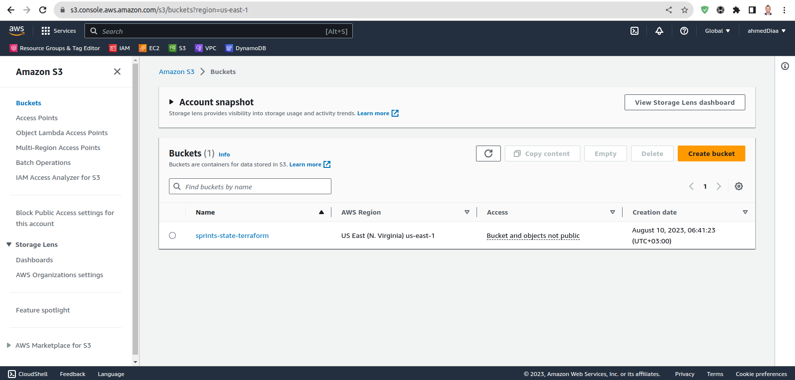
- 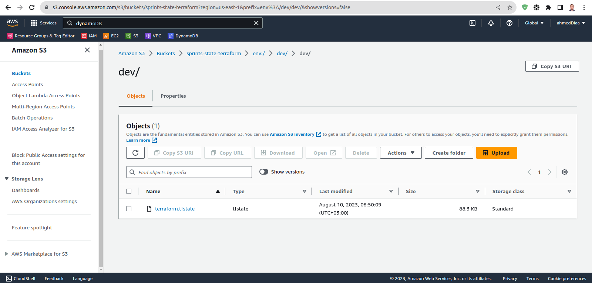

### DynamoDB

- 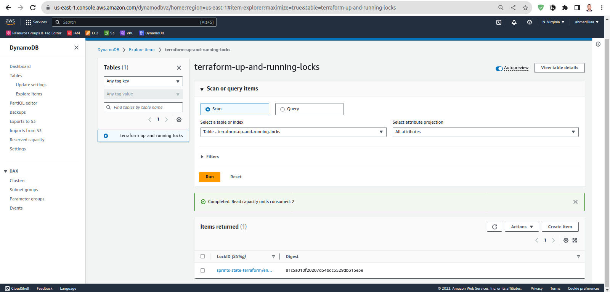

### all-ips file

- 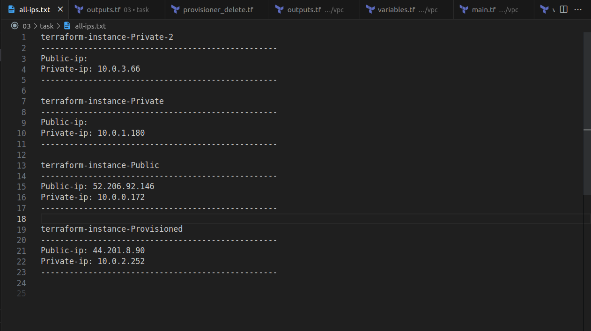

### Testing the acquired state lock

- 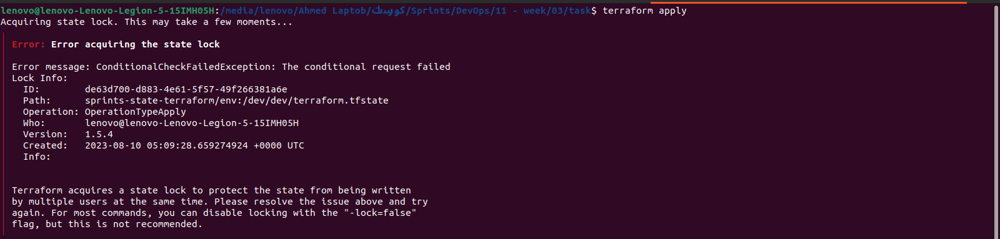

### outputs (AMI, IPs, Public DNS Load Balancer)

- 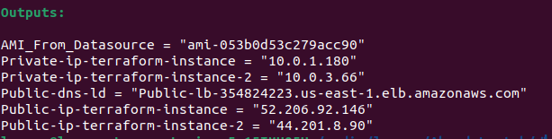

### Using Private and Public Load Balancer

- 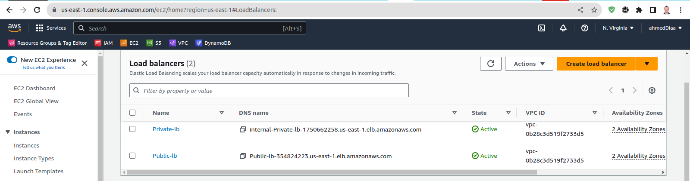
